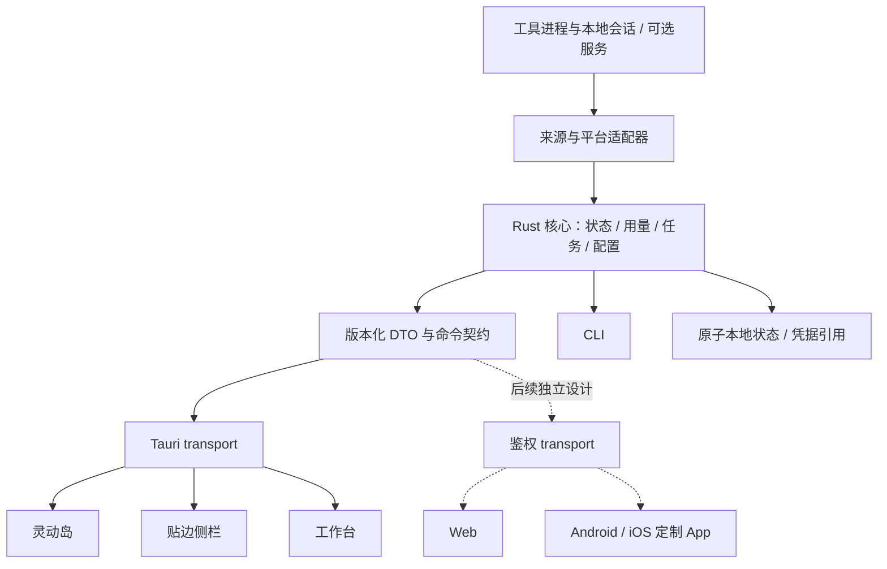

# AgentIsland 整体产品与技术方案

2026-10-03。综合当前 main 实现、用户确定的平台路线及外部功能调研。本文是整体方案入口；功能融合细节见 [25 号](25-feature-integration-plan.md)，品质验收见 [24 号](24-interface-quality.md)。标为“目标”的内容尚未交付。

具体模块、数据/命令契约、页面生命周期及交付批次见 [实现文档](implementation/README.md)。正式开工前按 [方向与门槛](implementation/08-direction-and-readiness.md)核对，存量能力按 [追溯表](implementation/09-baseline-and-traceability.md)保留。

## 1. 产品定位与总体判断

AgentIsland 是本机 AI 工具的轻量工作台：让用户知道谁在工作、需要处理什么、用了多少，并能进入来源、管理配置、组织任务与窗口。它不自建编码智能体；请求网关作为可选外部服务，任务执行编排后置。

产品由三种桌面入口构成：灵动岛负责即时感知，贴边侧栏负责持续观察，工作台负责组织和管理。三者使用同一份业务状态，不各自实现一套用量、任务或配置规则。用户可以只用灵动岛，也可以以工作台为主要入口。

**综合判断**：当前监控、用量、配置及通知基础已具备；下一步的关键是统一任务与来源、收敛导航和设计语言、补上窗口布局。直接堆入多个外部产品的完整界面，会重复“配置、用量、会话”入口，并增加常驻负担。以已有模块为基础逐步融合，按能力而非上游项目名称组织产品。

**平台顺序**：macOS → Windows → Linux → Web 与移动端。先把 macOS 的完整桌面范围做完并验收，再进入 Windows，之后 Linux。Web 和 Android / iOS 在桌面端稳定后单独规划；移动 App 特殊定制，两者之间的先后尚未确定。

## 2. 当前已有功能与保留边界

“已有”表示当前工作区存在实现与入口，不能推导所有工具、所有平台均已验证。本轮核对 README、Tauri 命令注册、前端页面和业务模块；没有重新进行全量真机验收，也没有把未发布工作区视为已发布版本。

| 模块 | 当前能力 | 必须保留的边界 | 实现依据 |
| --- | --- | --- | --- |
| 灵动岛 | 微细条/把手、展开列表、搜索、详情、用量分析、自动收起、四边吸附 | 紧凑、不中断输入；设置/用量返回的几何稳定仍按专门验收标准复查 | `app/ui/js/main.js`、`views.js`、`navigation.js`；`placement.rs` |
| 贴边侧栏 | 监控、用量、档位、待办、设置、通知、智能体管理；左右贴边和宽度配置 | 持续观察，不变成压缩版的所有工作台页面 | `views.js:renderSidebar`；`sidebar.css` |
| 工作台 | 概览、实时监控、待办、常用入口及分组功能导航；导航/顶栏保持，输入状态保留 | 目前是基础工作台，不是完整项目任务系统 | `views.js:renderWorkbench`；`workbench.css` |
| 工具识别与状态 | 进程、文件、会话证据共同判定；启停监控档案；ChatGPT/Codex 聚合展示 | 档案存在不等于有用量源或精确会话入口；Vibe Usage 属于用量工具，不列为智能体 | `registry.rs`、`procmon.rs`、`session.rs`、`observability.rs` |
| 工具身份 | Trae CN、TraeWork、豆包工作分别匹配；MiniMax Code 桌面/CLI 有专用来源 | Trae Code 的独立身份仍需补齐取证与适配，不能因用户要求三个就声称三个已完成 | `registry.rs`、`minimax.rs` |
| 用量与费用 | 最近 24h、累计、模型分布、小时趋势、本地 JSONL/SQLite 读取、费用估算 | 缓存读取不计入净消耗；缺失与零不同；费用带估算标记；本机与网关账单不直接相加 | `tokens.rs`、`cost.rs`、`report.rs`、`sqlite.rs` |
| 预算、预测、时长 | 24h Token 预算与告警、预测报告、连续运行记录/时长统计 | 预算不是供应商额度；预测依赖已有样本；执行时长不是人工验收状态 | `budget.rs`、`forecast.rs`、`duration.rs`、`engine.rs` |
| 异常与诊断 | CPU、内存连续增长、疑似卡死/观测不全、进程树、自检与诊断报告 | 稳定高 RSS 属正常占用；读不到不推断闲置；健康度不是任务质量评分 | `health.rs`、`resilience.rs`、`trees.rs`、`selftest.rs` |
| 会话来源目录 | 当前语义来源与任务保存的运行历史、工具/来源/标签筛选与受控导航 | 当前每工具至多一个选中语义来源，不代表完整工具会话历史；历史不冒充当前执行 | `sessions-page.js`、`task_sources.rs` |
| 来源跳转 | macOS Codex 根据语义来源进入对应会话；内部提醒保存触发目标；其他已接入 GUI 打开工具 | 打开工具不等于精确定位；导航不批准操作；外部事件不能自动绑定最新会话 | `session_navigation.rs`、`agent-actions.js` |
| Codex 档位 | 保存接口/模型配置、预览应用、备份、差异还原、外部改动冲突处理、白名单导入导出 | 只修改受支持配置；不验证模型/账号可用性；不接管原生登录；显示生效时机 | `provider.rs`、`atomicfile.rs`；`views.js:hydrateProvider` |
| MCP / Skills | 内建 Codex MCP 编辑、启停、删除、差异预览与备份；Codex/Claude/共享目录 Skills 清单与 Codex 用户级启停、本地包安装/更新/恢复 | MCP 限受支持本地形式与环境引用；用户 Skills 支持配置启停与 macOS 本地目录安装/更新/持久恢复；标准 YAML 元数据已支持有界解析；同步、原生加载和跨工具写入未验收 | `mcp_config.rs`、`skills_config.rs`、`skills_package.rs`、`capabilities.rs`、`mcp-page.js` |
| 本地待办 | 新增、勾选、删除、清除已完成、原子保存 | 普通待办尚无项目/运行/产出关联；勾选不等于批准 Agent 操作 | `todos.rs` |
| 提示词 | 本地库编辑/保存/移除，Codex 用户指令预览、应用、备份与还原 | 仅用户级完整正文替换，非空覆盖文件拒绝；项目规则及新会话加载需核对 | `prompts.rs`、`prompts-page.js`；实现文档 11 |
| 通知 | 确认、完成、成本提示；标准/专注/静默策略；可选远程渠道和测试/近期结果 | 默认关闭远程；飞书、PushPlus、OneBot、ntfy、HTTP、SMTP 等按自身回执判断，受理不等于手机已收到 | `notifier.rs`、`remote.rs`、`webhook.rs`、`smtp.rs`、`im.rs` |
| 系统设置 | 浅/深/跟随系统、启动登录、热键、菜单栏、显示器/停靠、采样与省电选项 | 原生功能按平台能力显示；配置写入失败要回滚并给原因 | `settings.rs`、`power.rs`、`main.rs` |
| 报告与 CLI | 用量/诊断报告、Markdown/CSV、状态 JSON、doctor、tokens、state、自检、check/clean、打开界面、事件上报、Raycast 清单、持续观测 | CLI/GUI 同口径；check 只读，clean 有真实终止行为；不以高内存单次采样自动清理 | `cli.rs`、`audit.rs`、`selfreport.rs`、`deeplink.rs` |
| 本地交付 | 单实例、按需创建窗口、macOS bundle 与 CLI、扫描/构建/重启/发布脚本 | 当前完整验证以 macOS 为主；Windows/Linux 不按构建结果宣称已交付 | `window_lifecycle.rs`、`main.rs`；`scripts/` |

以上业务文件均位于 `app/src-tauri/src/`，CSS 位于 `app/ui/css/`。具体工具覆盖以运行时档案与来源能力为准，方案不维护容易过期的“全部支持工具数量”。

## 3. 功能融合后的整体版图

| 产品域 | 保留已有 | 增量目标 | 主要入口 |
| --- | --- | --- | --- |
| 状态与会话 | 监控、动作、来源导航、异常依据 | 会话列表/筛选、可信来源关联、工具能力表 | 岛即时提示；工作台会话页 |
| 任务 | 本地简单待办 | 项目看板、待回答/确认方案/验收结果、运行与产出历史 | 岛单条需处理；工作台任务页 |
| 模型与连接 | Codex 档位、备份、冲突、本地模型选择与内建 MCP 管理 | 内建接口/协议治理、跨工具受控配置和 Skills 管理；外部连接为辅助 | 工作台；岛按需快捷入口 |
| 用量 | 本机统计、预算、预测、导出 | 来源对照、可选服务端用量、筛选与复盘 | 岛单行摘要；工作台用量页 |
| 窗口 | 自身停靠、侧栏与工作台生命周期 | GUI 工具窗口选择、布局预览、应用/撤销/保存 | 工作台窗口布局页 |
| 通知与工具 | 现有通知、自检、诊断、设置、CLI | 统一通知历史、能力说明和问题定位入口 | 岛即时；工作台管理组 |
| 工作空间 | 本地引用组合、逐项核对及分项实际应用收据/恢复入口已接入；原生实际应用与恢复仍需验收 | 关联项目、任务、配置与窗口布局 | 各模块稳定后进入工作台 |

借鉴范围：拆解 Todos 的任务与人工关口、CC Switch 的跨工具配置治理、Magpie 的紧凑选择与快照、New API 的模型/接口/协议/路由及额度能力，转译为本产品内建模块。可选外部连接不是功能融合交付，不要求安装这些上游产品；路由执行与渠道治理须独立设计验收。外部项目的源码、许可证和接入证据详见 [25 号 §3、§7、§9](25-feature-integration-plan.md)。当前不默认安装网关，不将四个产品各做成一个一级菜单。

## 4. 信息架构与三种形态

工作台的目标导航：工作组为 **概览、会话、任务、模型与连接、用量、窗口布局**；管理组为 **工具与扩展、通知、设置**。尚未实现的页面不预先放入可用导航。

| 形态 | 首屏内容 | 可承接的操作 | 内容升级到工作台的条件 |
| --- | --- | --- | --- |
| 灵动岛 | 当前 Agent 状态、至多一条需处理、简短用量 | 展开、进入来源、查看详情、进入工作台 | 比较、编辑、历史、权限、批量或撤销 |
| 侧栏 | 持续监控、当前任务/需处理、简短摘要 | 筛选、来源跳转、简单待办及工作台入口 | 多列数据、完整配置与任务产出 |
| 工作台 | 运行与需处理摘要、当前任务、少量常用入口 | 任务、会话、连接、用量、窗口与设置的完整流程 | 独立页内展开，避免多层弹窗 |

概览不重复铺满每个模块的卡片。用量导出属于用量页动作；诊断属于工具管理或异常详情；通知配置与历史在同一产品域。当前已有页面按此逐步归位，保留原功能和可发现入口。

## 5. 技术栈与架构

### 5.1 当前与建议

| 层 | 当前 | 本阶段建议及理由 |
| --- | --- | --- |
| 桌面壳 | Tauri v2 + 系统 WebView | 沿用；原生窗口、托盘、热键、单实例和平台权限通过适配器实现 |
| 业务核心 | Rust 2021，仓库最低 Rust 1.90；serde、sysinfo、toml_edit 等 | 沿用；监控、状态判定、用量、配置与任务规则集中在 Rust，UI/CLI 共用 |
| 前端 | HTML / CSS / 原生 JavaScript ES Modules，无 npm 构建 | macOS 完成阶段沿用；拆分大页面和生命周期，建立可复用组件、稳定身份与统一状态契约 |
| 类型契约 | serde 序列化与前端约定 | 先补 DTO 文档/JSDoc 和契约回归；复杂度增长后再评估 TypeScript 构建，不同时迁移整个前端框架 |
| 动效 | CSS + Web Animations API；原生窗口几何 | CSS 负责微反馈；WAAPI 负责可中断页面/表面过渡；原生几何一处协调，不添加常驻动画框架 |
| 数据 | 设置/档位/待办原子 JSON；第三方会话 SQLite/JSONL 只读 | 按 ADR 0011 保持；运行历史增长到迁移判据时评估自有 SQLite，不改第三方库 |
| 图标与图表 | 已有官方工具资产、SVG 图标与用量展示 | 同一套线性 SVG 动作图标；工具使用经核对的官方资产；图表按页加载，优先 SVG，性能需要时再评估库 |
| 凭据 | 远程通知 macOS 钥匙串；档位只保存环境变量名 | macOS 保持；Windows/Linux 单独实现安全凭据能力，无支持时明确不可用，不回退明文文件 |
| 网关/服务 | 无内置网关 | 先内建模型/接口/协议与预算治理；网关执行单列能力与资源/授权验收。外部服务连接后置，不代替内建功能 |
| 测试与交付 | Rust、Node JS 守护、模拟 UI、原生复核、脚本门禁 | 按风险选回归；跨平台分别真机验收，发布校验不能跳过 |
| Web/移动 | 未定案 | 只预留业务契约与 transport 边界；框架、部署、同步与移动原生壳在对应阶段决策 |

Tauri 支持 HTML/CSS/JS 前端并使用系统 WebView；各平台 WebView 不同，因此同一份 CSS/动效仍须分别验证。[Tauri 介绍](https://v2.tauri.app/start/)、[WebView 文档](https://v2.tauri.app/reference/webview-versions/)。WAAPI 提供动画控制能力，适合将取消/完成纳入导航生命周期。[MDN](https://developer.mozilla.org/en-US/docs/Web/API/Web_Animations_API)。这里的具体技术取舍是本项目建议，不是上游文档的性能承诺。

不建议现在改 Electron、重写 SwiftUI/WPF、或同时引入 React/Svelte 与大组件库。现阶段的问题主要是状态/窗口协调、来源契约和界面组织；换框架不会自动修复这些问题。将来前端迁移须先做包含输入保持、可中断导航和三种壳的等价验证，再决定成本是否值得。

### 5.2 目标模块关系

这是目标分层，不表示当前目录已经完成拆分。先从高风险接缝开始：业务判定与 UI 展示分开、来源解析与导航分开、导航与批准分开、原生平台操作与纯几何计算分开。暂不做无使用场景的通用插件系统。

核心实体：Agent、Session、Project、Task、Run、Artifact、Connection、Profile、WindowLayout。每个实体保持稳定 ID 与来源；任务、运行、产出版本分开，配置目标与实际运行模型分开。平台适配器返回 `supported / unavailable / permission_required` 等明确能力及原因，界面据此决定入口。

前端 transport 隔离 Tauri `invoke` 和订阅；页面只依赖业务 DTO。未来 Web 的远程控制面必须有鉴权与动作授权，现有只出网通知不直接升级为远程执行服务。

## 6. 前端 UI 风格

设计方向为 **安静、紧凑、精细的桌面工具**。用清楚的排版、稳定的表面和准确的微反馈建立品质；灵动岛小巧，工作台有呼吸感，但不把页面做成展示型网站。Awwwards/FWA 是完成度参照，交付结论依据验收证据。

以下是目标 token 与布局建议，不声称现有全部样式已统一：

| 项目 | 方案 |
| --- | --- |
| 色彩 | 浅色瓷白与深色石墨；主行动使用克制的蓝色；绿色工作、琥珀人工关口、红色失败；状态同时有文字/图标 |
| 材质 | 原生外壳/导航可使用系统材质，主要阅读区不透明；每个区域只使用一层必要阴影和细分隔 |
| 排版 | 本地系统字体与中文回退；正文 13–14px，辅助 12px，工作台页标题 20–24px；数字等宽，单位和口径可见 |
| 间距 | 4 / 8 / 12 / 16 / 24 / 32px 语义尺度；紧凑行与编辑区分别定义密度，避免全页统一大留白 |
| 圆角 | 小控件约 8px、区域 12px、浮层/岛表面 18px；胶囊用于标签和岛轮廓，避免每个容器都最大圆角 |
| 图标 | 动作图标使用同套 24px viewBox 和约 1.5–1.75px 描边；显示 16–18px；桌面点击区至少 28–32px，图标按钮有名称/提示 |
| 工具身份 | 官方图标保持品牌比例与留白，适配浅深底板；Trae CN / Code / Work 标签与来源分别验证 |
| 信息层级 | 标题 → 当前结果/需处理 → 次级说明 → 按需证据；少用整块卡片包裹单行信息，列表与分隔优先 |
| 工作台布局 | 固定导航与顶栏，正文独立滚动；宽时双列概览，窄时单列；表格局部滚动，不造成窗口横向溢出 |
| 三形态一致 | 颜色、动作名称、状态语义、图标一致；布局与密度按岛/侧栏/工作台分别设计 |
| 设置 | 常用项首屏，复杂项折叠；标签简短，解释靠近相关字段；失败留住输入，保存结果明确 |

空白、加载、零值、无来源、无权限、过期、离线、失败分别设计。已有数据刷新失败时保留旧内容并显示更新时间，不整页闪回骨架。扩展名称与协议仅在编辑或诊断场景出现，不占日常监控首屏。

## 7. 动效方案：连续且可中断

动效由“为什么发生变化”驱动。导航、尺寸、状态刷新各有生命周期，不能让周期采样重新播放入场动画。下面的时长是初始设计参数，必须在原生界面上校准，不能用时长表代替顺滑验收。

| 场景 | 初始节奏 | 动作与约束 |
| --- | --- | --- |
| 悬停/按下/焦点 | 80–140ms | 色彩和轻微明暗反馈；焦点清楚，按钮不改变布局尺寸 |
| 工作台切页 | 离场约 100ms、入场约 200–240ms，允许短重叠 | 导航/顶栏静止；正文淡入，必要时最多 4–6px 位移；快速点击取消旧过渡 |
| 灵动岛展开/进入 | 表面约 280–340ms | 一个持续表面，文字不缩放；内容仅必要淡入；原生窗口与 Web 表面共用目标几何 |
| 灵动岛返回/收起 | 约 220–280ms | 从当前视觉状态接续；保持贴边锚点；异步内容晚到只更新当前路由，不二次弹动 |
| 列表增删/需处理更新 | 140–200ms | 保留稳定行身份，少量局部变化；高频用量刷新直接更新或短淡变，不滚动计数 |
| 折叠设置/详情 | 160–220ms | 局部高度与透明度变化；不推动原生窗口反复缩放 |
| 窗口布局 | 先预览，再一次执行 | 以原生窗口能力为准；先确保位置正确，不为了视觉效果重复发送窗口移动 |
| 减少动态效果 | 直接切换或极短淡变 | 停止位移、缩放、循环装饰；焦点和结果反馈仍保留 |

统一缓动建议：进入用 `cubic-bezier(.22,1,.36,1)`，离开用更短的收尾曲线；岛尺寸变化默认无过冲。常驻区域不使用循环发光、粒子、重模糊或反复弹簧。长等待在明确的操作区域显示进度，不能将“工作中”做成整窗不断运动。

**防抖动协议**：导航生成 transition ID → 确定目标与所需 viewport → 协调一次几何提交/确认 → 表面从当前尺寸过渡 → 内容按当前路由挂载 → 落定后清理。新的导航取消旧任务；采样只更新数据。进入设置、进入 Agent 用量以及返回后再次采样都纳入检查；动画结束时对齐不能证明中间没有抖动。

## 8. 关键交互闭环

| 流程 | 交互方案 | 完成条件 |
| --- | --- | --- |
| 看到需处理 | 岛显示“工具 + 具体动作”；点击可信来源；工作台提供问题/方案/产出全文 | 正确来源可见；导航不自动批准；过期动作不可提交 |
| 查看 Agent | 列表查看状态/用量；来源按钮独立，说明“进入会话”或“打开工具” | 返回保持列表位置、焦点与窗口锚点；未验证深链不假装精确定位 |
| 完成任务 | 普通待办勾选；Agent 任务执行结束先结果就绪，再显式验收 | 运行历史保留，重跑生成新 run，不将进程退出当成验收 |
| 切换模型/档位 | 选择 → 展示当前/目标差异和生效范围 → 应用 → 显示结果/备份 | 外部漂移拒绝覆盖并可重新读取；失败留输入；实际模型另行取证 |
| 连接外部服务 | 选择服务 → 地址/凭据引用 → 手动测试 → 显示能力与来源 | 认证、无权限、断线与超时分开；先只读，不自动接管请求 |
| 排列窗口 | 选择窗口和屏幕 → 模板预览 → 应用 → 逐窗结果 → 可撤销 | 只移动选择目标；部分失败可恢复；撤销复核同一窗口身份 |
| 设置/表单 | 常用项直接可达；高级项展开；切页按需保留草稿 | 重复点当前页不丢输入；自动采样不覆写；失败有原因和恢复动作 |
| 通知 | 准确事件 + 来源；聚合去重，遵循静默/专注策略 | 正常高内存不重复误报；远程回执与送达区别清楚 |
| 用量分析 | 单一入口；默认最近 24h，可切累计与来源；导出在页内 | 缺数据与 0 区分；估算和来源可见；历史费用不由当前档位推导 |

键盘规则：Tab 顺序按视觉阅读顺序，Enter/空格操作按钮，Esc 退出当前浮层/返回适用层级，返回后焦点落回触发元素。仅对不可恢复或跨出导航范围的操作展示必要确认，并写清对象与影响；普通跳转不加确认步骤。

## 9. 分平台落地

| 平台 | 复用 | 需要单独完成与核实 |
| --- | --- | --- |
| macOS 当前阶段 | 现有 Rust/UI/CLI 与本地数据 | 来源身份、岛返回几何、完整任务/连接/窗口流程、资源与交付门禁 |
| Windows 第二阶段 | 状态、用量、任务与配置规则、设计 token/组件 | POSIX 残留、进程身份、WebView2 行为、DPI/多屏、托盘/窗口/会话入口、凭据与安装更新 |
| Linux 第三阶段 | 同一核心、数据契约和界面组件 | 发行版依赖、WebKitGTK 行为、桌面通知/托盘、X11/Wayland 与窗口管理器权限；明确支持环境 |
| Web 后续 | 领域契约、部分工作台组件 | 数据如何到达浏览器、鉴权、连接生命周期、权限与部署；不能直接读取本机进程和排列窗口 |
| Android / iOS 后续 | 状态/任务/来源语义与视觉 token | 独立触屏导航、推送、后台、离线和配对；远程查看/处理场景与本地桌面行为分开 |

Windows/Linux 的原生实现 API、Web 框架、移动框架均须在对应阶段做小范围真机验证再定案。Tauri 具备移动方向不等于直接适合全部移动场景；不提前决定移动端技术栈。

## 10. 实施顺序与验收出口

平台顺序在外层，功能迭代在各平台内层，不并行展开五种客户端。

| macOS 阶段 | 工作 | 可检查的出口 |
| --- | --- | --- |
| M0 · 现有体验收敛 | 岛/设置/用量返回、文案、图标、健康提示；工作台导航/表单稳定 | 原生进入返回逐帧证据、快速跳转/晚到报告/采样更新回归；保留已有功能 |
| M1 · 基础统一 | 组件/token、来源与能力契约；工具身份缺口；三形态导航归位 | 浅深色、键盘、窄宽布局、缺来源/权限行为一致 |
| M2 · 任务与窗口 | 本地看板、三类人工关口、run/artifact 历史；macOS GUI 排列 | 旧待办迁移无损、过期动作/重跑正确；多屏、关闭窗口、部分失败和撤销 |
| M3 · 配置与连接 | 统一模型与连接页；跨工具受控适配；可选外部服务 | 差异/冲突/备份/还原、生效时机、权限/断网；本机与服务用量无重复计数 |
| M4 · 桌面收尾 | 全功能入口巡检、资源测量、文档与打包发布 | macOS 核心流程和门禁通过，再进入 Windows |
| W / L | Windows 完整适配，再 Linux | 各平台真实安装、升级、三形态、任务/配置/通知/窗口流程验收；不以 macOS 结果代替 |
| 后续 | Web 与移动产品设计 | 用户场景、远程契约与客户端技术方案确认后实施 |

资源预算先测量：记录空闲/有任务、岛/侧栏/工作台、采样/切页的 CPU、RSS、唤醒、数据读取量和动画帧耗时。常驻任务有界缓存，未显示重页停止刷新，订阅/计时器随生命周期释放；不在没有数据的情况下承诺固定 MB。出现回归先定位来源，不能把外部 Agent 的正常内存当成本应用异常。

验收包含功能真实性、视觉细节、动作准确性、来源可信度、性能与可访问性。每轮按“现象 → 原因 → 修正 → 重测证据”记录；失败项保留，不用奖项措辞代替结果。Rust/JS/模拟 UI 与原生复核互补；真实桌面自动化按现有隔离要求运行。扫描先于提交，版本一致、构建、实际重启、tag/Release 按仓库脚本交付；门禁阻塞须如实记录。

## 11. 风险、待定项与决策依据

| 风险/问题 | 处理方式 |
| --- | --- |
| 大量功能挤进常驻岛 | 岛单条行动摘要；编辑/历史/批量进入工作台；非当前状态的快捷项不常驻 |
| 来源和运行状态被混淆 | 稳定 ID + 来源能力；缺证据明确降级；执行结束、异常、人工验收分别建模 |
| 同一事实多套实现 | Rust 统一业务口径，三形态共享 DTO；原生适配返回能力，不将平台判断散到页面 |
| 框架/存储提前迁移 | macOS 先沿用现栈；按实际复杂度与 ADR 0011 判据再决策，保留迁移回归 |
| 外部服务改变产品负担 | 可选、按需连接、先只读；网关不内嵌、不默认启动 |
| Linux 窗口能力不一致 | 明确目标环境与支持表，未支持操作给原因，不绕过系统限制 |
| 移动/Web 需求尚不清楚 | 后置定制，不锁定框架，不承诺桌面原生能力直接复用 |
| Todos 源码/许可及服务契约未实测 | 目前只借鉴已核对产品文档；代码复用与接入另做验证 |

已有依据：README 与当前代码；[长期口径](../../CONTEXT.md)、[Rust 主线 ADR](../adr/0016-rust-only-main.md)、[存储 ADR](../adr/0011-local-state-storage-and-migration-triggers.md)、[品质标准](24-interface-quality.md)、[融合方案](25-feature-integration-plan.md)。外部动效决策参照私有调研库的持续表面、按用途动效 token 与任务关口案例；具体参数属于本方案建议。

本机 Skills 的安装记录支持逐项预览移入废纸篓，保留包不递归删除，目标及启停配置不变；100条安装容量有显式清理退出动作，历史默认最近5条，完整范围及证据见 [安装与恢复](implementation/12-local-skill-packages.md)。

标准技能包支持 Codex / Claude Code 用户级目标选择、手动整包同步及绑定目标的持久恢复；目录候选按需核对，工具专属语法不转换，不把目录发布当成客户端加载。两工具用户级正文编辑已接入；客户端发现及隔离原生验收继续开放，详见 [12](implementation/12-local-skill-packages.md)。

窗口模块已接入持久排列意图/当时结果和重启后逐窗恢复：手动选择同工具当前窗口，后台历史位置预览后复核应用，拒绝旧身份、屏幕越界及外部漂移。历史默认折叠，逐项确认删除仅处理记录并释放容量；未知结算保留实际反馈与本次撤销。工作空间窗口历史关联及隔离原生验收仍开放，见 [04](implementation/04-macos-window-layouts.md) 与 [ADR 0037](../adr/0037-window-operation-history.md)。

工作空间窗口分项与持久排列历史已关联；保存/打开不移动窗口，实际排列后台核对组合与规则，重启恢复定位具体记录并重新选择当前窗口。独立文件回归与受控界面证据已补齐，原生验收和整版退出条件继续按原范围核实，见 [10](implementation/10-workspaces.md)。
